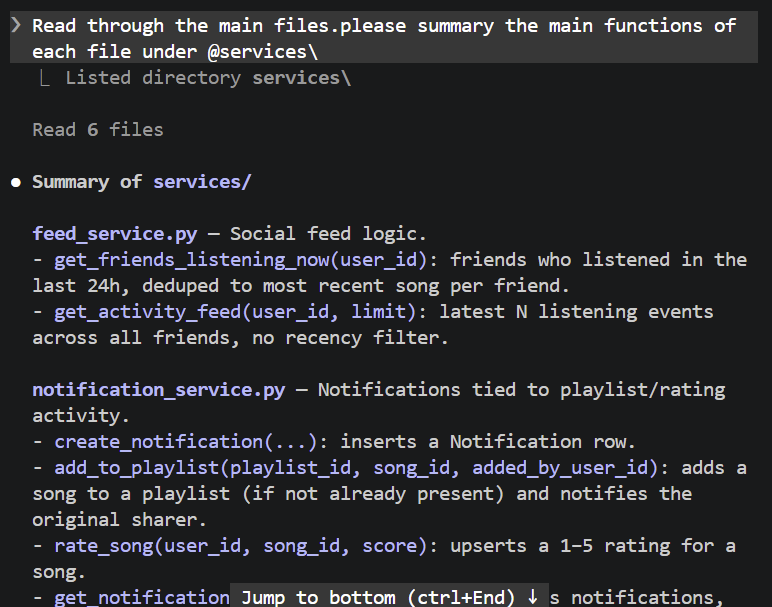
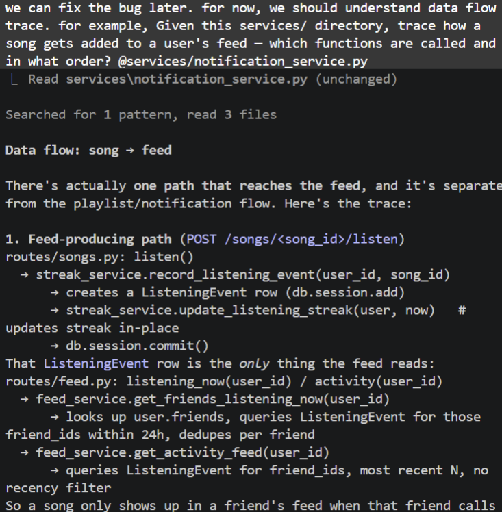
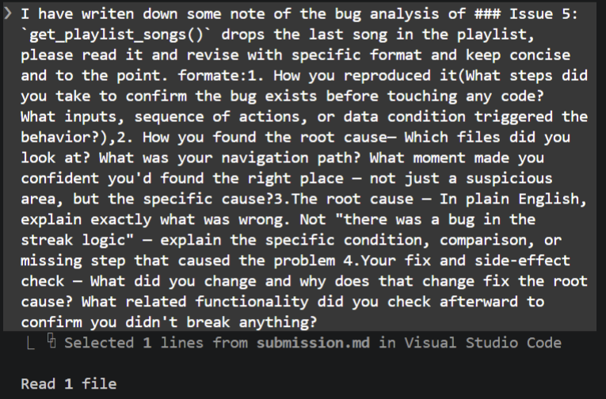
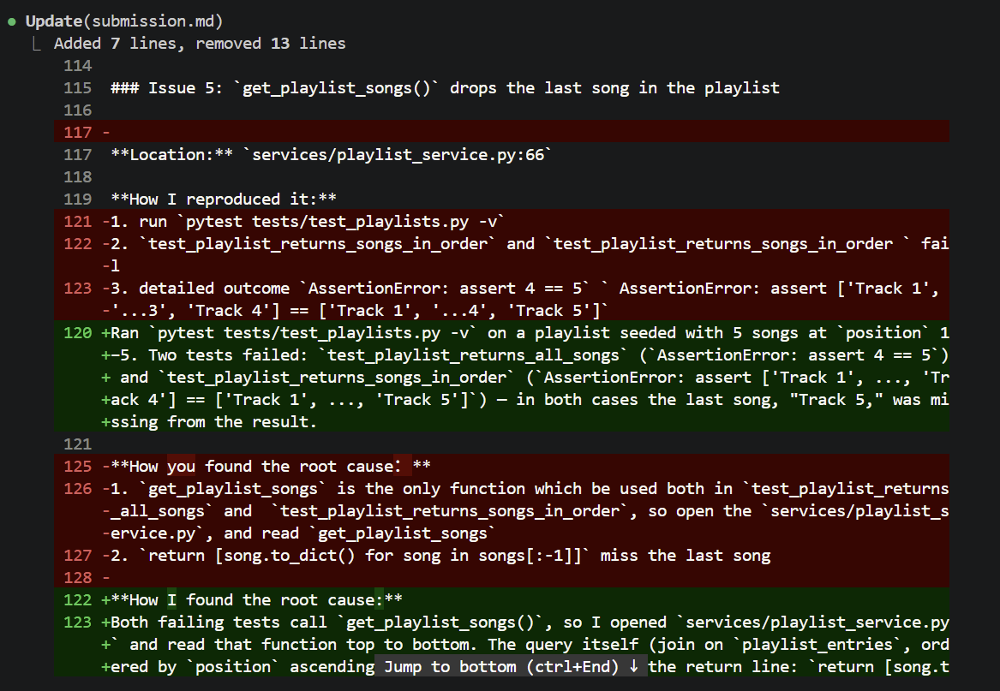
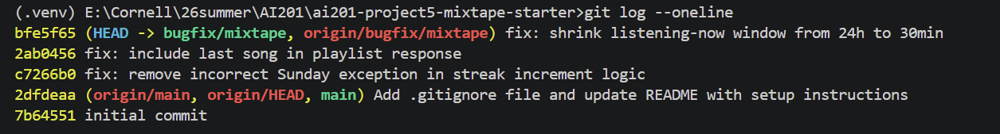

# AI Usage

I used Claude (Claude Code) throughout this project for navigation, debugging support, and write-up help — not to write the fixes for me. Below is what it helped with and where I checked or overrode its output.

**Codebase navigation.** Early on, I asked it to summarize what each file in `services/` does (screenshot: `ai_usage_summary.png`) and then to trace specific call chains end-to-end — e.g., "how does a song get added to a user's feed" and "trace how `record_listening_event` interacts" (screenshot: `ai_usage_trace.png`). This gave me the route → service → model chain for each feature faster than reading every file cold, and is the basis for the Codebase Map and data-flow section below.


**Debugging support and write-up.** After I found and fixed each bug myself (running tests, reading the relevant service file, editing the code), I asked it to rephrase my rough debugging notes into the four-part Root Cause Analysis format the assignment requires (screenshots: `ai_usage_rephrase.png`, `ai_usage_rephrase2.png`). It tightened vague phrasing (e.g. turned "the assertion demonstrates the function miss the last track" into a precise explanation naming the exact `[:-1]` slice and why it always drops the last element) without changing what actually happened.
 
**Where I verified or overrode its output:**
- It initially flagged a fourth candidate bug — duplicate rows in `search_songs()` from an `outerjoin` on `song_tags` without `.distinct()` — based on reading the query logic. I ran `pytest tests/test_search.py -v` myself before accepting this, and all 5 tests passed; the duplication didn't actually reproduce in this SQLAlchemy version. I dropped it from the submission rather than trust the static read.
- For the feed threshold bug, it first suggested reproducing from nova's perspective (most friends in the seed data). That request returned no visible bug, because each of nova's friends had a very recent event masking their older one via the per-friend dedup in `get_friends_listening_now()`. I caught this by inspecting the response myself, and re-queried from darius's perspective instead, which is what actually exposed the stale 2-hour-old event.
- Before writing each Root Cause Analysis entry, I re-ran the relevant tests (`pytest tests/test_streaks.py`, `pytest tests/test_playlists.py`) or re-issued the `curl` request myself to confirm the fix worked, rather than taking a description of expected behavior at face value.

---

# Mixtape Codebase Map

## Main files and their responsibilities

**`app.py`** — Flask application factory. Creates the Flask app, configures SQLAlchemy (`db`), registers the four blueprints (`songs`, `playlists`, `users`, `feed`) under their URL prefixes, and calls `db.create_all()`.

**`models.py`** — Defines all SQLAlchemy models and association tables:
- `User` — has `listening_streak`, `last_listened_at`; relates to `Song` (shared), `Rating`, `ListeningEvent`, `Notification`, `Playlist`, and `friends` (self-referential many-to-many via the `friendships` table).
- `Tag` — simple name entity, linked to `Song` via `song_tags` (many-to-many).
- `Song` — has `shared_by` (FK to User), `share_note`; relates to `Rating`, `ListeningEvent`, `tags`.
- `ListeningEvent` — one row per "user listened to song" action, with `listened_at`. This is the sole data source for the feed.
- `Rating` — one row per (user, song) pair (`unique_user_song_rating` constraint), holds `score` (1–5). Ratings are their own model, not a column on `Song`.
- `Playlist` — has `created_by`, `is_collaborative`; songs attached via `playlist_entries`, an association table that carries `position`, `added_by`, and `added_at` — so playlist membership has explicit ordering and provenance, not just insertion order.
- `Notification` — `user_id` (recipient), `notification_type`, `body`, `read` flag.

**`routes/`** — One blueprint per resource, each doing only request parsing and response formatting:
- `songs.py` — `/songs/search`, `/songs/<id>`, `/songs/<id>/rate`, `/songs/<id>/listen`
- `playlists.py` — `/playlists/` (create), `/playlists/<id>`, `/playlists/<id>/songs` (get/add)
- `users.py` — `/users/<id>`, `/users/<id>/streak`, `/users/<id>/notifications`, `/users/notifications/<id>/read`
- `feed.py` — `/feed/<user_id>/listening-now`, `/feed/<user_id>/activity`

**`services/`** — All business logic lives here; routes call straight into it:
- `search_service.py` — `search_songs()` (title/artist substring match), `get_song()`
- `playlist_service.py` — `create_playlist()`, `get_playlist()`, `get_playlist_songs()` (ordered by `position`), `get_user_playlists()`
- `notification_service.py` — `add_to_playlist()`, `rate_song()`, `create_notification()`, `get_notifications()`, `mark_as_read()`
- `streak_service.py` — `record_listening_event()`, `update_listening_streak()`, `get_streak()`
- `feed_service.py` — `get_friends_listening_now()` (last 24h, one entry per friend), `get_activity_feed()` (unbounded time window, top N, no dedup)

**`seed_data.py`** — populates the DB with sample users/songs/playlists for local testing.

**`tests/`** — `test_playlists.py`, `test_search.py`, `test_streaks.py` — one test file per service area.

---

## Data flow — a friend rates a shared song and gets nothing, but adding it to a playlist does notify

Two related-but-separate flows worth tracing together, since they're often confused:

**1. Rating a song** (`POST /songs/<id>/rate`)
```
routes/songs.py: rate()
  → notification_service.rate_song(user_id, song_id, score)
      → validates score is 1–5
      → upserts a Rating row (unique on user_id+song_id)
      → db.session.commit()
```
No `Notification` is created and no `ListeningEvent` is written. Rating is an isolated write — the original sharer is not told their song was rated, and it never appears in any feed.

**2. Adding a song to a playlist** (`POST /playlists/<id>/songs`)
```
routes/playlists.py: add_song()
  → notification_service.add_to_playlist(playlist_id, song_id, added_by_user_id)
      → appends Song to Playlist.songs (via playlist_entries) if not already present
      → db.session.commit()
      → if song.shared_by != added_by_user_id:
            create_notification(user_id=song.shared_by, type="song_added_to_playlist", body=...)
```
This is the one place a `Notification` gets created automatically, and only for this one action.

**3. Listening to a song** (`POST /songs/<id>/listen`) — the only path that feeds the feed
```
routes/songs.py: listen()
  → streak_service.record_listening_event(user_id, song_id)
      → db.session.add(ListeningEvent(...))
      → update_listening_streak(user, now)   # +1 / reset / no-op depending on last_listened_at
      → db.session.commit()
```
Later, `feed_service.get_friends_listening_now()` / `get_activity_feed()` query `ListeningEvent` for the current user's friends to build the feed.

**Takeaway:** rating, playlist-adding, and listening are three independent writes with three different downstream effects (nothing / notification / feed+streak). None of them trigger each other — e.g., adding a song to a playlist does not create a `ListeningEvent`, so it never shows up as "friend activity" in the feed.

---

## Patterns noticed

- **Routes are thin, services own logic.** Every route handler does: parse request → call one service function → `jsonify()` the result (or catch `ValueError` → 400/404). No SQLAlchemy queries or business rules appear in `routes/`.
- **Services raise `ValueError` for not-found/invalid-input; routes translate that to HTTP errors.** This is the only error-handling convention in the app — no custom exception classes.
- **Every model has a hand-written `to_dict()`** used directly in `jsonify()` calls — no serialization library.
- **Association tables carry extra metadata when needed** (`playlist_entries` has `position`/`added_by`/`added_at`), but plain many-to-many tables (`friendships`, `song_tags`) don't.
- **Feed and notifications are separate, uncoupled systems** built on different tables (`ListeningEvent` vs `Notification`) — despite both being "things a user's friends might want to know about," there's no shared abstraction between them, so features like playlist-adds are visible in notifications but invisible in the feed, and vice versa.

---

## Root Cause Analysis

### Issue 1: My listening streak keeps resetting

**Location:** `services/streak_service.py:73`

```python
elif days_since_last == 1 and today.weekday() != 6:
    user.listening_streak += 1
else:
    user.listening_streak = 1
```

**How I reproduced it:**
Ran `pytest tests/test_streaks.py -v`. Four streak tests passed, but `test_streak_increments_on_sunday` failed. The test listened on Saturday, June 15, 2024, then listened again on Sunday, June 16, 2024. The expected streak was 2, but the actual streak stayed at 1, confirming the app fails to increment the streak across a Saturday-to-Sunday boundary.

**How I found the root cause:**
Read `record_listening_event()` → `update_listening_streak()`, and found the problem at `elif days_since_last == 1 and today.weekday() != 6`.

**Root cause:**
The streak-increment branch has an extra, undocumented condition — `today.weekday() != 6` (Sunday) — bolted onto the "listened on the immediately following day" check. There's no comment or stated rule explaining why Sunday is excluded, and it contradicts the function's own docstring ("If the user listened yesterday: streak increments by 1" — no day-of-week exception is mentioned). Any consecutive-day listen where the second day is a Sunday falls through to the `else` branch and incorrectly resets the streak to 1 instead of incrementing it.

**Fix and side-effect check:**
Deleted `and today.weekday() != 6`, leaving `elif days_since_last == 1:`. Re-ran `pytest tests/test_streaks.py -v` — all 5 tests pass, including the Sunday case. Also checked references to `record_listening_event`, `weekday()`, and `listening_streak` across the repository: `record_listening_event` is the only caller of the streak update path, and `listening_streak` is only ever mutated through `streak_service.py`. No other code depended on the Sunday-specific branch, so this was a targeted, single-line fix.

### Issue 5: `get_playlist_songs()` drops the last song in the playlist

**Location:** `services/playlist_service.py:66`

**How I reproduced it:**
Ran `pytest tests/test_playlists.py -v` on a playlist seeded with 5 songs at `position` 1–5. Two tests failed: `test_playlist_returns_all_songs` (`AssertionError: assert 4 == 5`) and `test_playlist_returns_songs_in_order` (`AssertionError: assert ['Track 1', ..., 'Track 4'] == ['Track 1', ..., 'Track 5']`) — in both cases the last song, "Track 5," was missing from the result.

**How I found the root cause:**
Both failing tests call `get_playlist_songs()`, so I opened `services/playlist_service.py` and read that function top to bottom. The query itself (join on `playlist_entries`, ordered by `position` ascending) is correct — the bug is in the return line: `return [song.to_dict() for song in songs[:-1]]`. The `[:-1]` slice unconditionally drops the last element of an already-correct, already-ordered result set.

**Root cause:**
`songs` is the correct, fully-ordered query result. The final line slices it with `[:-1]`, which discards the last item regardless of playlist size or content. This directly contradicts the function's own docstring ("returns all songs in the playlist") — there's no conditional logic tied to that slice, so any playlist with one or more songs always loses exactly its last-position song.

**Fix and side-effect check:**
Removed `[:-1]`, changing the return to `[song.to_dict() for song in songs]`. Re-ran `pytest tests/test_playlists.py -v` — all 3 tests pass, including `test_empty_playlist_returns_empty_list` (unaffected, since slicing an empty list was already safe). Checked for other callers with `findstr /S /N "get_playlist_songs" services\*.py routes\*.py`: the only other reference is an unused `from services.playlist_service import get_playlist_songs` import in `notification_service.py` — it's never called there, so no other code path depends on the old (buggy) 4-song behavior.

---
### Issue 2: "Friends Listening Now" shows people from yesterday

**Location:** `services/feed_service.py:13` and `:32`

**How I reproduced it:**
Ran `python seed_data.py`, then `flask run`, and queried `/feed/<user_id>/listening-now` from two different users' perspectives. Nova has the most friends (darius, simone, kenji), so I queried as her first (`5f005b06-...`) and got all 3 back — but each friend's most recent event was only 10-20 minutes old, so no bug was visible; per-friend deduping was masking their older events behind a legitimately recent one. Switching to darius's perspective (`d8eaab68-...`) exposed it: the response included nova with `"listened_at": "2026-07-09T14:54:40"`, about 2 hours before the request, still labeled as part of "listening now." Per `seed_data.py`'s own comment, only events "within the past 30 minutes" should appear in this feed — nova's 2-hour-old event should not have qualified.

**How I found the root cause:**
Started at `routes/feed.py: listening_now(user_id)`, which calls `feed_service.get_friends_listening_now(user_id)`. Inside that function, `cutoff = datetime.now(timezone.utc) - RECENT_THRESHOLD`, and `RECENT_THRESHOLD` is defined at the top of the file as `timedelta(hours=24)`. The cutoff math and query filter are both correct — the problem is the threshold value itself.

**Root cause:**
`RECENT_THRESHOLD = timedelta(hours=24)` treats any listen from the past 24 hours as "listening now." That's a full day of history being labeled as real-time presence, so a friend whose last play was hours ago — even from the previous calendar day — still shows up as if they're currently listening.

**Fix and side-effect check:**
Changed `RECENT_THRESHOLD` from `timedelta(hours=24)` to `timedelta(minutes=30)`, matching the "within the past 30 minutes" window `seed_data.py` was already designed around. Re-ran `curl http://127.0.0.1:5000/feed/d8eaab68-8ce9-4e98-87c9-376cb7d0a6ad/listening-now` after the change — nova (2 hours old) no longer appeared, only simone (within 30 minutes) remained. Checked `get_activity_feed()` in the same file to confirm it doesn't reference `RECENT_THRESHOLD` — it's unbounded by design and unaffected by this change.

# Screenshot of git log --oneline
